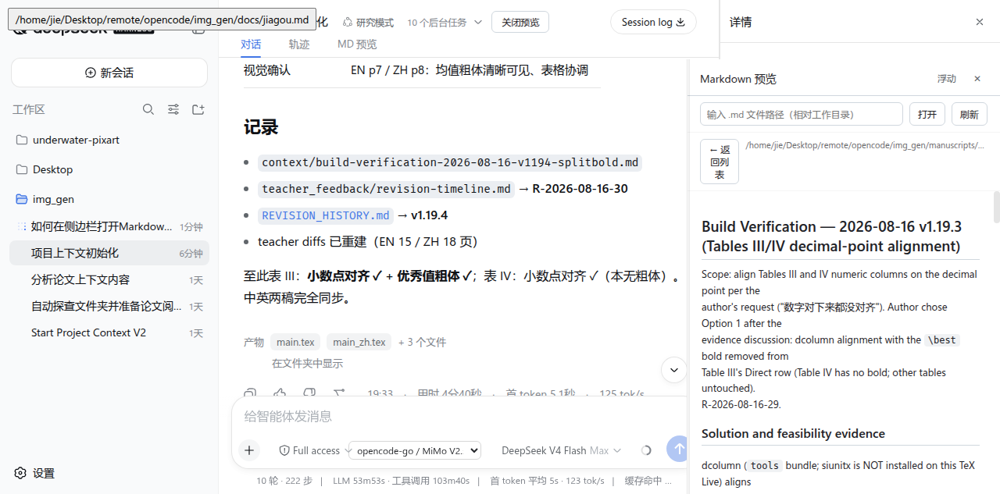

<div align="center">

# dsh-md-preview

*A Markdown preview plugin for DeepSeek Harness*

</div>

> **Click a `.md` in your conversation — no more jumping to VSCode. Open a side-by-side preview on the right and read on.**

<p align="center">
  
</p>

A DeepSeek Harness (DSH) plugin that adds an **MD Preview** entry to the session header, tracks the `.md` files your session has read or written, and opens an in-chat `.md` reference **side-by-side in the right panel** instead of launching the system editor (e.g. VSCode).

## Built with dsh-vision-opencode

This plugin pairs with [**dsh-vision-opencode**](https://github.com/poiuyjie/dsh-vision-opencode) — and was developed and polished on top of that vision plugin. Together they make a much stronger workflow:

- **Visual-verification loop**: `dsh-vision-opencode` gives a text-only main model image understanding (`vision_read_image`), so the model can "see" rendered document pages; this plugin then opens the corresponding `.md` source **side-by-side on the right** — look at the rendered image, compare against the source, revise, verify, and record in one flow
- **Image-to-source comparison**: the left conversation stream holds the visual verdicts ("Table III renders cleanly, no overflow"), while the right panel holds the Markdown source — review and edit side by side
- **Great for document / paper workflows**: LaTeX build checks, layout QA, revision records — visual confirmation plus source preview in split view

Install them together:

```bash
cd ~/.dsh/profiles/web
npm pkg set "dependencies.dsh-vision-opencode=github:poiuyjie/dsh-vision-opencode"
npm pkg set "dependencies.dsh-md-preview=github:poiuyjie/dsh-md-preview"
```

## Features

- **Side-by-side preview**: click a `.md` reference in the conversation (produced-file chips / inline references / tool-card paths) to open it in the right panel — top-aligned with the conversation content, draggable width (up to about half the screen), layout yields automatically without covering the chat
- **Per-session recent list**: automatically collects the `.md` files your session read/wrote (read/write/edit/delete + time + file mtime); each session only sees files it actually touched — no cross-session leakage
- **Two display modes**:
  - Floating window: draggable, resizable, position/size remembered (localStorage)
  - Docked right panel: side-by-side with the conversation, drag the left divider to resize
- **Modifier-key escape hatch**: hold Ctrl/Cmd/Shift while clicking a `.md` reference to open it with the system default app (VSCode) instead
- **Manual open**: type a workspace-relative `.md` path to preview it
- **Full Markdown rendering**: headings / lists / tables / code blocks / quotes / inline code / math snippets / image links
- **Full-page tab**: also available as a "MD Preview" tab in the Conversation/Trajectory bar

## System support

> ⚠️ **Tested on Ubuntu only** (Ubuntu 24.04 / Bash, DSH `0.1.0-rc.6`). On Windows, macOS, or other Linux distros you will need to **adjust things yourself**: install paths, the `~/.dsh` profile directory, the `cordis.patch.yml` syntax, and the package-manager commands (npm/pnpm) may all differ — adapt to your environment.

## Installation

### Option 0: dsh plugin add (native, recommended)

The package declares a `dsh.bundle` manifest and ships its own `cordis.patch.yml`, so it installs with the native plugin command (auto-applied as a profile layer — no manual `cordis.patch.yml` edits needed):

```bash
dsh plugin --profile web add poiuyjie/dsh-md-preview
```

### Option 1: Clone locally (recommended — easy to edit and to follow updates)

Clone from GitHub (example: `~/plugins`):

```bash
mkdir -p ~/plugins && cd ~/plugins
git clone https://github.com/poiuyjie/dsh-md-preview.git
cd dsh-md-preview
```

Then reference the local path from your DSH web profile (Ubuntu: `~/.dsh/profiles/web`):

```bash
cd ~/.dsh/profiles/web
npm pkg set "dependencies.dsh-md-preview=file:~/plugins/dsh-md-preview"
npm install
```

### Option 2: Reference GitHub directly (no clone, quick)

```bash
cd ~/.dsh/profiles/web
npm pkg set "dependencies.dsh-md-preview=github:poiuyjie/dsh-md-preview"
npm install
```

### Enable the plugin manually (Option 1 / Option 2 only — `dsh plugin add` does this automatically)

Add an entry to the profile's `cordis.patch.yml`:

```yaml
- insert:
    - id: md-preview
      name: 'dsh-md-preview'
```

Restart `dsh web` and refresh the page — you'll see the **MD Preview** button in the session header.

> Tip: with Option 1, `git pull` in the cloned repo follows updates; the plugin is plain JS with no build step — after editing code, a page refresh is enough for the client half (HMR supported).

## Uninstall

From the profile directory (Ubuntu: `~/.dsh/profiles/web`):

```bash
cd ~/.dsh/profiles/web
npm pkg delete dependencies.dsh-md-preview
npm install
```

(If you installed via Option 1, the dependency is removed automatically; for a full cleanup also run `rm -rf ~/plugins/dsh-md-preview`.)

Then remove the insert entry from `cordis.patch.yml`:

```yaml
# Remove this block:
- insert:
    - id: md-preview
      name: 'dsh-md-preview'
```

Finally restart `dsh web`. Uninstalling never deletes your `.md` files or session history — it only removes the preview panel.

## Usage

1. Click the **MD Preview** button in the session header to open the panel;
2. The panel shows your session's recently accessed `.md` files (name / path / op history / snippet);
3. Click a `.md` reference in the message stream → the right panel opens and loads that file automatically;
4. Drag the divider on the panel's left edge to resize; click "浮动" (Float) to switch to a floating window; click "✕" to close;
5. Hold Ctrl/Cmd/Shift while clicking a reference → opens with your system default editor.

## Development

```bash
# The plugin itself (Host half + Client half, plain JS, no build step)
ls index.js client.js
```

- `index.js` — Host half. Listens to `fs/observed` to record md file access (isolated per session), serves `/md-preview/api/{recent,read,peek}` HTTP endpoints
- `client.js` — Client half. Panel UI, click interception (capture-phase detection of md reference buttons), right-dock + layout yielding

## License

[MIT](LICENSE)
